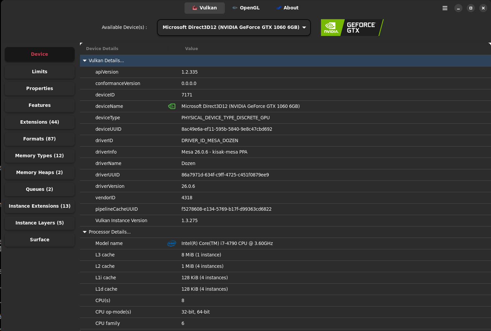
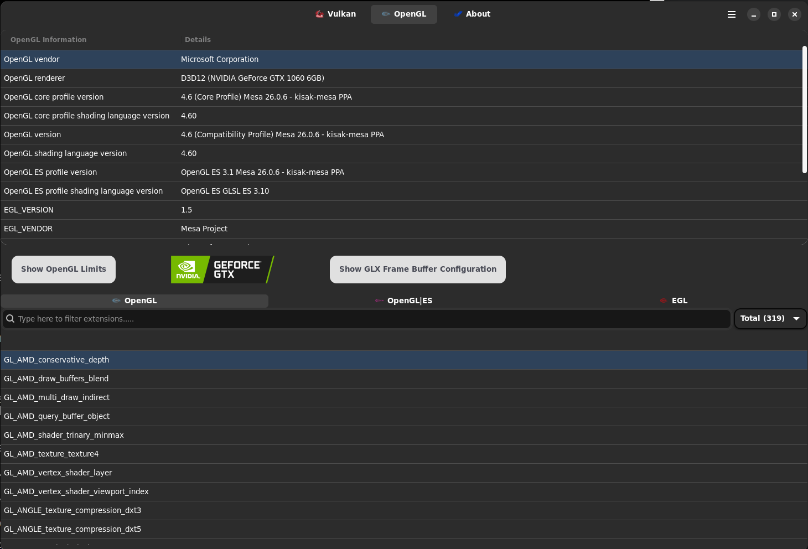

# docker-gui-test

WSL2 内の Docker で GPU と GUI を使用できるか、簡単に確認するためのリポジトリです。

本リポジトリでは、GPU 情報の可視化ツールとして [GPU-Viewer](https://github.com/arunsivaramanneo/GPU-Viewer) を使用しています。

## 注意事項

**⚠️ Windows 10 の場合、GPU 対応は期待できない可能性が高いです**

WSL2 で GPU を使用するには、WDDM 3.0 以上のサポートが必要です。  
しかし **Windows 10 は WDDM 2.x シリーズのサポート**に留まっており、WDDM 3.0 以降の機能に対応していません。

このため、Windows 10 上の WSL2 および WSL2 内で動作する Docker においても、GPU にアクセスすることが難しい場合があります。

**推奨環境：**
- **Windows 11** 以降を使用することをお勧めします
- Windows 11 は WDDM 3.0 以降に対応しており、WSL2 での GPU サポートがより安定しています

**確認方法：**
- `glxinfo -B` の実行結果で `direct rendering: Yes` が表示される場合は、GPU が認識されている可能性があります
- `GALLIUM_DRIVER: d3d12` での動作確認が必要です

## Build

```bash
docker build -t ubuntu-x11-apps .
```

## Run

```bash
docker run -it --rm --ipc=host \
	--device /dev/dxg \
	-v /usr/lib/wsl:/usr/lib/wsl \
	-v /mnt/wslg:/mnt/wslg \
	-v /tmp/.X11-unix:/tmp/.X11-unix \
	-e DISPLAY=:0 \
	-e WAYLAND_DISPLAY=wayland-0 \
	-e XDG_RUNTIME_DIR=/mnt/wslg/runtime-dir \
	-e GALLIUM_DRIVER=d3d12 \
	-e PULSE_SERVER=/mnt/wslg/PulseServer \
	-e LD_LIBRARY_PATH=/usr/lib/wsl/lib \
	ubuntu-x11-apps /bin/bash -c 'glxinfo -B && xeyes'
```

## Docker Compose

```bash
docker compose up --build
```

## 実行結果

`png` 配下の画像は、この構成での実行結果です。

### Vulkan



### OpenGL




